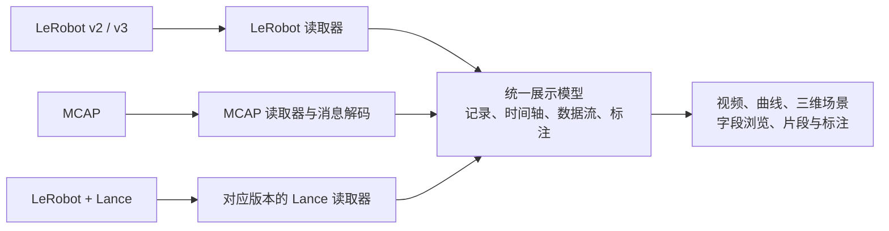

# 18 · 数据可视化：独立的「可视化」页面、报告里的迷你播放器与 mcap 字段映射

> 状态：**定稿 v1.1（2026-10-04）**—— 需求方三轮答复（§8.1–§8.3）与给定的架构都已并入，决策 D60–D64 在 `00-overview.md` §7；ReRun 的参考版本定为 0.38.1（§3.1）；第二期的内容先记在 §10。v1.1 是开工前对着代码的核对（§8.4）：迷你版改走任务级接口、mcap 的时钟与质检对齐、预检描述符只加不改、URL 安全的相机 key、外部标注 zip 的上传、浏览器解码能力的兜底、v3 曲线按行组读，契约细节以 §7 为准。实现从 F13.1 开始（§9）。分支 `feat/data-visualizer`（从 `feat/curator-v2` 分出，worktree `~/ws/daft-viz`）。
> 需求账本：阶段 13（F13.0–F13.8）。
> 静态稿：`frontend/mockups/visualize.html`（完整版，独立页面）、`episode-visualize-mini.html`（报告里的迷你版）、`dataset-add-mcap.html`（添加数据集的 mcap 配置），手动验证步骤在 `frontend/mockups/README.md`「第三批」。

## 0. 开工指引

读的顺序：§1 背景 → §2 范围与两种布局的功能对照 → §4 架构与数据供给（读取器 → 统一展示模型 → 视图，这是实现上最要紧的一节）→ §5 播放器与页面规格 → §6 字段映射模版 → §7 契约与接口 → §8 已定的决策与需求方三轮答复 → §9 工作包 → §10 第二期（不在本阶段）。
静态稿先看一遍（三页，双击即可打开），对着 §5 核对。

要动的地方：

| 组件 | 位置 | 要做的 |
|---|---|---|
| 契约 | `docs/contracts/openapi.yaml`（C4）、`docs/contracts/cli/preflight.schema.json`（C2）、新增 `docs/contracts/viz-mapping.schema.json`（C7）与 `examples/viz-mapping.json` | §7 的端点、预检描述符扩展、映射模版 Schema；升版本、刷新锁、`npm run gen:api` |
| Daemon | `backend/daemon/routes/viz.py`（新）、`backend/daemon/viz/`（新包：数据源、读取器、展示模型、曲线、标注、帧包、转封装与转码、缓存、映射与模版）、`repo/`（数据集的 `viz_mapping`、模版表、迁移）、`uploads.py`（`viz_annotations`）、`results/episode.py`（`EpisodeView.fps` / `dataset_id`） | 统一展示模型与两个读取器；数据集级（完整版）与任务级（迷你版）两组接口共用读取器；相机供给（直连 / 本地 / 转封装 / 帧包 / 转码）、mcap 探测与映射存储、转码开关 `CURATOR_VIZ_TRANSCODE` |
| 内核 | `backend/curation/ingest/mcap_reader.py`、`cli/containers.py`、`streams/clip.py`、`cli/lerobot_meta.py` | summary 里补 schema 与编码；按映射模版解消息；JPEG 帧包与 fMP4 转封装；预检写出 features / 相机编码 / 分段候选 |
| 前端 | `frontend/src/features/visualizer/`（新）、`pages/visualize/`（新路由 `/visualize`）、`components/AppLayout.tsx`（侧栏「数据集 › 可视化」）、`pages/report/EpisodesTab.tsx`、`pages/adjudication/EpisodeCard.tsx`、`pages/datasets/*`（「可视化」新窗口、「可视化（旧）」）、`features/datasets/AddDatasetDrawer.tsx`、`locales/zh.ts`、`mocks/` | 播放器、独立页面与左侧栏、报告与裁决的弹窗、mcap 配置表单 |
| 部署 | `docs/design/09-deployment.md` §2.1 | 环境变量 `CURATOR_VIZ_TRANSCODE`（缺省开）、`CURATOR_VIZ_CACHE_DIR`（缺省临时盘下的 `viz-cache`）、`CURATOR_VIZ_CACHE_GB`、`CURATOR_VIZ_TRANSCODE_WORKERS`；都有 Daemon 缺省，Chart 不用改，要关转码用 `extraEnv` |
| 文档 | 本篇、`07-frontend.md` §2 / §4.4 / §5 / §6、`03-rest-api.md`、`05-registry-and-preflight.md`、`00-overview.md` §7（已有 D60–D64）、各 README | 实现时同步 |

## 1. 背景与目标

今天控制台的「可视化」是跳到同一部署里的 ReRun 网页查看器（D48），地址经 Daemon 代签（D55，设计 15）。用下来的问题：

- **慢**：ReRun 网页端对 `.mcap` / `.mp4` 是整文件下载完再导入，mcap 解析在 wasm 里单线程跑；LeRobot 导入器只有原生端，网页端能开是因为 F10 做了特殊处理。打开一条 episode 要等很久。
- **TOS 支持弱**：代签链路能用，但 ReRun 的加载模型（整文件）和 TOS 的按区间读天然不合。
- **mcap 字段没法按客户定义映射**：ReRun 对 mcap 只有「选哪些 decoder、过滤哪些 topic」，没有声明式的「这个 topic 是相机、那个字段是关节位置」的配置；自定义 protobuf schema（如 ABC-130k 的 `RobotState`）只能看成一堆原始字段。
- **界面与火山不统一**。

目标：在控制台里内置一个数据播放器 ——

1. 多路相机与运动曲线在**同一条进度条**下同步播放；
2. **两种布局**：独立的「可视化」页面（完整版：信息全、可自定义，左侧选数据集与 episode），质检报告 / 人工裁决里的弹窗（迷你版：固定布局、只看核心信息）；
3. mcap 数据集在**添加时确认一份字段映射模版**（内置 + 自带），可视化与质检都按它读；
4. 架构上是**读取器 → 统一展示模型 → 视图**（D61），以后加格式只加读取器；
5. 做完后报告 Episode 明细里的「各机位视频」退役；跳 ReRun 的旧入口保留一个版本，文字改为「可视化（旧）」。

本期不做（另立后续阶段，不在本篇的 F13 范围里；但统一展示模型与读取器接口按全集定，留好位）：Lance 读取器、三维场景（末端轨迹、点云、URDF）、深度图渲染、浏览器内解 mcap / 解 parquet、我们自己的标注标准、ReRun 入口的最终下线。

## 2. 范围：三个交付面与两种布局

| 交付面 | 在哪 | 内容 |
|---|---|---|
| 完整版 | 侧栏「数据集」分组下的二级项「可视化」（另一项是「数据集列表」），路由 `/visualize?dataset=<id>&ep=<n>`；数据集列表 / 详情的「可视化」在新窗口打开它 | 左侧可收起的侧栏（选数据集 → 列 episode）+ 播放器 + 「数据集信息」树状浏览 |
| 迷你版 | 质检报告 Episode 明细抽屉、人工裁决卡片、任务详情的 Episode 流水线 → 「可视化」弹窗 | 只有播放器；布局由发现决定；进度条标出发现的区间；可跳到完整版。数据走**任务级**接口（§7）：读任务冻结的输入（D27）、用任务的输入密钥和冻结在 `run.json` 里的映射，所以登记被删、数据集变了或任务没有登记（`dataset_id` 为空）都不影响报告；没有登记或登记已删时「在可视化页打开」置灰并写原因 |
| mcap 配置 | 添加数据集抽屉（格式识别为 mcap 时出现）；数据集详情的「mcap 配置」入口 | 探测 → 模版起草 → 表格确认 → 保存 / 另存为模版 / 导入导出 |
| 外部标注文件 | 添加数据集抽屉（任何格式，选填）；数据集详情可换 | 上传一个 JSON 或按 episode 编号命名的 zip（Argus 风格），存为上传件挂在数据集上，读取器合并成一条「外部标注」轨 |

两种布局的功能对照（编号对应需求原文 4.2 的 (1)–(8)）：

| 功能 | 完整版 | 迷你版 |
|---|---|---|
| (1) 统一进度条，视频与曲线同步 | ✓ | ✓ |
| (2) 不允许全屏；播放速度 1x / 1.5x / 2x；跳转到指定帧的输入框 | ✓ | ✓ |
| (3) 模块化格子（每格选视频或曲线）；布局模版「智能展示视频和运动曲线（默认）/ 仅视频 / 仅曲线 / 自定义」与格子数 | ✓ | 格子由发现决定，没有模版选择 |
| (5) 顶栏：数据集 + episode 号、帧率、任务描述（没有则「无任务描述」） | ✓ | ✓ |
| (6) 字幕栏：有分段标注才显示，实时跟随 | ✓ | ✓ |
| (7) 空格子显示「+」，点开选择内容 | ✓ | 无空格子 |
| (8) 格子右上角「更换」「放大（占满播放器）」；完整版另有「清空」 | ✓ | 更换、放大 |
| (8′) 右侧信息侧栏（分辨率、帧率、编码、字段、当前值…），可收起；打开时挤压格子，不覆盖 | ✓ | ✓ |
| 「平台转码」标签（D60） | ✓ | ✓ |
| 左侧栏选数据集与 episode；播放器下方的「数据集信息」树；走带上的上一条 / 下一条 | ✓ | — |
| 进度条上发现的区间色段（blocking 红 / review 橙 / info 灰）与证据帧点标；「发现」芯片切换聚焦；「在可视化页打开」 | — | ✓ |

格式矩阵（本期实现的两个读取器；Lance 第二期）：

| 格式 | 相机 | 曲线 | 任务描述 | 分段标注 |
|---|---|---|---|---|
| LeRobot v2.0 / v2.1 | `dtype=video` 的 feature（image 帧序列本期不做） | 数值 feature（`float32/64`，按 `names` 分组） | `tasks.jsonl` / 首帧 `task_index` | §4.5 的适配规则 |
| LeRobot v3.0 | 同上，按 episodes 表的 from / to 切 | 同上，按 `dataset_from/to_index` 行窗 | `tasks.parquet` / episodes 的 `tasks` | 同上，另有 `subtask_index` + `meta/subtasks.parquet`、`language` 列 |
| mcap | 映射里的 `cameras` | 映射里的 `series` | 映射里的 `task` | 映射里的 `segments` 或外部标注文件 |
| LeRobot + Lance | 第二期：对应版本的 Lance 读取器（今天的 `lance_reader` 只支持 lerobot-lance-convert ≥ 0.3，整表拷贝），产出同一个展示模型 | | | |

## 3. 调研结论

### 3.1 参考的三个工具

- **HF `lerobot/visualize_dataset`**：上排相机、语言指令卡、走带（上一条 / 播放 / 下一条 / 循环、滑杆、`24 / 24` 帧计数、空格与方向键）、下排按关节分组的曲线：同名的 `action`（虚线）与 `observation.state`（实线）叠画，图例里带当前值，勾选可隐藏某条。本篇的曲线格就是这个样子。
- **Pantheon data-board**：双机位 + 深色时间线上的「字幕」（`both grippers · settle above table · idle`）+ 关键事件列表（时刻 + 事件 + 标签）+ 右侧评估侧栏。本篇的字幕栏与进度条上的分段色段来自这里；它的标注格式见 §3.4。
- **ReRun**（参考版本 **0.38.1**：`~/ws/rerun` 已切到分支 `ref-0.38.1` = 「Release 0.38.1」提交 `5c524e9e19`，它的 `main`（fork `bytedance-iaas/rerun`，`107beb60f2`，`0.39.0-alpha.1+dev`）比发布点多 138 个提交，其中 mcap 相关的只有 lens 选择器支持字符串字面量、`Lenses::apply` 改签名、错误信息带完整上下文（#12942）这类重构，没有功能修复；LeRobot 多了导入诊断汇总与 `LargeUtf8` 任务文本。下面的描述以 0.38.1 为准，两版在这些点上一致）：
  - LeRobot：只认目录结构判版本；feature 键原样作实体路径（点不是分隔符）；`float32/64` → `Scalars` + 一次性的 `SeriesLines.names`；`video` 在 v2 是整文件 `AssetVideo` + 逐帧引用，在 v3 是 `VideoStream` 按 `[from, to)` 切 GOP（H.264 / H.265 有 B 帧或不在 GOP 边界要 ffmpeg）；时间轴只有 `frame_index`（有就只用它）或 `timestamp`；`string` / `task_index` / `subtask_index` / `language` → 文本；`int16`、其他 `int64`、`bool` 跳过；不读 `stats.json`、`robot_type`。默认布局不是导入器给的，是查看器的启发式：子树里不止一张彩图就每个相机一个 2D 视图，每个 `Scalars` 实体一个时序视图，超过 12 个视图改页签。
  - mcap：decoders（`ros2msg` 手写的 JointState / Imu / … → `ros2_reflection` → `protobuf` → `raw` 兜底）+ lenses（foxglove 13 个：CompressedImage、CompressedVideo（h264 / h265 / av1 / vp8 / vp9 → `VideoStream`）、RawImage、PoseInFrame(s)、FrameTransform(s)、PointCloud…；ROS 的 Image / CompressedImage（jpeg / png → `EncodedImage`，h264 → `VideoStream`）/ JointState（→ `<topic>/position|velocity|effort`，名字作标签）…）；实体路径 = topic；每条消息两个时间轴 `message_log_time` / `message_publish_time`，另加消息里的时间戳。**没有声明式的字段映射**，用户只能选 decoder、过滤 topic、设时间窗；网页端整文件下载后单线程解析。
  - 结论：我们要的「字段映射模版」就是 lenses 的声明式版本 —— 默认模版按 schema 自动归类（等价于 foxglove / ros2 lenses），再允许按 topic 覆盖；这也正是 ReRun 做不到而客户需要的。
  - 火山网关上现网的 ReRun（2026-10-03 用 Chrome 看了 `so101-pick-place-v2`）：左侧「数据来源」树按 episode 列出（每条是一个预转好的 RRD，`来源 RRD 版本 0.36.0`，3–4 MiB / 条，`File via SDK`），中间是启发式蓝图——`action`、`observation.state` 两个时序视图 + 每路相机一个 2D 视图 + `task` 文本，右侧选择面板，底部 `frame_index` 时间轴与数据流树。我们的完整版布局与它一一对应：左侧栏 ≈ 数据来源树，格子 ≈ 蓝图视图，信息侧栏 ≈ 选择面板，「数据集信息」树 ≈ 数据流树。

### 3.2 样本集的真实元数据（桶 `curation-robo-anchor`，anchor 63 子集 + anchor-nc 25 子集）

| 维度 | 看到的情况 | 对设计的影响 |
|---|---|---|
| 相机路数 | 1（PushT、FastUMI 单臂）到 10（RH20T `cam_<序列号>` × 10）；SO-101 五路、HABIT 五路、双 UR5e 四路 RGB-D | 格子要能放 1–3 列 × 1–3 行；超过 9 路的默认只上前几路，其余在「+」里选 |
| 分辨率 / 编码 | 96×96 到 1280×720；绝大多数 `av1 yuv420p`；**FastUMI 是 `mpeg4`（MPEG-4 Part 2，浏览器放不了）** | 需要「播不了就由 Daemon 转码」的兜底（§4.2，D60） |
| 深度 | `observation.images.front.depth`、`observation.depths.*` 为 `uint16` 列（不是视频） | 本期不渲染，树里可见、「+」里置灰 |
| state / action | 维度 2–29；`names` 有列表（`shoulder_pan.pos …`）、字典（`{"motors": [...]}`）、缺失（RH20T 全部 `null`）三种；RH20T 另有 `observation.state.ee_pose / joint / gripper`、`force / torque / robot_ft`；HABIT 有 60 多个 `robot0.* / robot1.*` 字段；Galaxea 把 state / action 拆成 `observation.state.left_arm`、`action.left_arm` 等十几列 | 曲线分组规则要能处理没有名字（用 `dim_i`）、字段很多（默认只上 state / action，其余在「+」里）和拆列（按前缀合成一组）的情况 |
| 任务与分段 | 任务文本在 `tasks.jsonl / parquet`；分段的写法五花八门（§3.4） | 不能硬编码一种字段名：已知的几种写法自动识别，识别不出的警告「标注格式不支持」（§4.5，D64） |
| mcap（GenRobot UMI） | foxglove protobuf：`/robotN/sensor/camera0/compressed`（`CompressedImage` JPEG 1280×720 30 Hz）、`/robotN/vio/eef_pose`（`PoseInFrame` 30 Hz）、`/robotN/sensor/magnetic_encoder`（50 Hz）、IMU 200 Hz、`camera_info`、`robot_info`、`system_info`；没有任务字段 | 内置 UMI 模版（已有识别逻辑）；JPEG 相机要用帧包（§4.2） |
| mcap（ABC-130k） | `foxglove.CompressedVideo`：顶部双目 **H.265**、腕部 H.264，30 Hz；自定义 schema `RobotState / GripperState`（200–270 Hz，`/left-arm-state`、`/left-arm-action`…）；`/instruction` topic 与 `episode-metadata`（`task_name`、相机型号与分辨率） | 自定义 protobuf 要按描述符展开数值叶子让用户确认；state / action 成对的 topic 叠画；H.265 要看浏览器能力 |

### 3.3 平台现状（代码）

- 前端：Arco 原生主题，页面壳 `AppLayout`，侧栏是 概览 / 质检（质检任务、人工裁决）/ 数据集 / 系统和资源配置；数据集详情页没有页签。「可视化」按钮只在数据集列表与详情页头（F10.3），报告里没有。报告 Episode 明细的「各机位视频」是 `features/media/SyncedVideos` + `SignedMedia`（`GET /media/sign`，任务级）+ `syncPlayback.SyncController`（按 episode 时间对齐、2 s 预读、跟随任一路）。发现的区间 `time_s` 可点（所有机位一起跳），`frames` 只显示、不换算（EpisodeView 没有 fps）。
- Daemon：`GET /datasets/episodes` 只给 LeRobot 相机的预签名地址（mcap 为空）；mcap 相机只有任务级的 `GET /tasks/{id}/episodes/{i}/cameras/{cam}.mp4`（内存里封装：JPEG → **MJPEG mp4，浏览器 `<video>` 放不了**；H.264 Annex-B 转封装；H.265、PNG、RawImage 拒绝；这个路由没写进 C4）。`POST /datasets/{id}/sign` 能签任意键的 GET（Range 不参与签名，一个地址可复用）。**没有任何接口返回逐帧的 state / action 序列**。
- 内核：mcap 的映射只在站点配置 `ingest.mcap_mapping`（全局、无校验、不按数据集），默认 `/action`、`/observation.state`、`/task`、`/observation.images.` 前缀，另有内置 UMI 识别；`McapSummary` 不保留 schema 名与消息编码；只用 `log_time`；预检描述符里没有 features / names / 分辨率 / 编码 / topic 清单。F5.16 的 EEF `record_mapping` 是模块参数（上传件），不在数据集上。Lance 读取器只支持 lerobot-lance-convert ≥ 0.3 的三表布局，TOS 上整表拷到源缓存。

### 3.4 分段标注的现成格式（2026-10-03 核实）

没有一个通用标准，但有几种成型的写法，统一标注模型（§4.5）要能装下它们：

| 来源 | 写法 | 读成什么 |
|---|---|---|
| LeRobot v3（官方，最新 `lerobot`） | 逐帧 `subtask_index`（int64）+ `meta/subtasks.parquet`（`subtask_index`, `subtask`）；ReRun 也认 | 片段：连续相同 `subtask_index` 的帧为一段，名称查表 |
| LeRobot v3 的 `dtype: language` 列（HIW-500 等） | `language_persistent` / `language_events`：每帧一个列表，元素 `{role, content, style('subtask'…), timestamp, camera, tool_calls}`；persistent 从 `timestamp` 起持续有效，events 是瞬时的 | persistent 的 `style=subtask` → 片段（下一条起点为终点）；events → 事件 |
| Galaxea（LeRobot v2.1） | 逐帧 `task_index` 在一条 episode 里变化（7 个步骤文本在 `tasks.jsonl` 里，中英文用 `@` 连接）；`coarse_task_index` 是整条的任务；`quality_index` / `coarse_quality_index` 指向 `tasks.jsonl` 里的 `qualified` / `unqualified` | 片段：`task_index` 的连续段；片段质量取同一段的 `quality_index`；条目任务取 `coarse_task_index` |
| HABIT（LeRobot v2.0） | 逐帧 `low_level_task_index` + `meta/subtasks.jsonl`，`human_role_subtask_index` + `meta/human_subtasks.jsonl`；布尔段列 `is_intervention_segment` / `is_high_jerk_segment` / `is_error_segment`；episodes 行里有 `low_level_tasks[]`、`task_status`（如 `recovered`） | 片段（两套：机器人分步、人的分步）；布尔列 → 带标志的片段；条目标签 `task_status` |
| RSS 2026（LeRobot v2.1） | 逐帧字符串列 `subtask`（这个数据集全是 `TODO` 占位） | 字符串连续段 → 片段；全是占位时不显示（预检已有 FILE-8 / LABEL-3 的提示） |
| Pantheon Argus（外部标注，开源） | 每条 episode 一个 JSON：`timeline[]`（`t_s`, `end_s`, `arm`, `verb_class`, `object`, `carry_phase`, `contribution` = advancing / wasteful / idle, `progress`）、`key_events[]`、`completion{outcome, goal frame}`、`operator_mistakes`、`recovery`、`data_issues`、`state_changes`、`scene_graph`；已发布的 `labels-2026-09-28` 用的是 `event_labels[]` 同一套字段 | `timeline` → 片段（名称 `verb_class`，部位 `arm`，贡献 `contribution`）；`key_events` → 事件；`completion` → 条目标签。h200-14 上有本地副本 `raw/pantheon_labels/published_labels_2026-09-28`，可作外部标注文件的接入样本 |
| mcap | 没有约定；映射里指定 `segments` 的 topic 与字段，或附件 JSON | 片段 / 事件 |

## 4. 架构与数据供给

### 4.0 读取器 → 统一展示模型 → 视图（D61）



- **数据源**（`daemon/viz/source.py`）：读取器不关心字节从哪来。数据集级（完整版）的数据源是登记：登记的地址、绑定的访问密钥、最近一次预检与文件清单、数据集上的映射；任务级（迷你版）的数据源是任务冻结的输入：任务的输入地址与输入密钥、`preflight.json` 与 `source_manifest.json`（D27）、`run.json` 里冻结的映射。两者都给出同样的几样东西：读对象 / 区间读、对象大小、浏览器能直接播的地址（私有桶预签名、公开桶原地址、本地挂载没有）、缓存用的指纹。
- **读取器**（Daemon 内，`daemon/viz/readers/<format>.py`）只认自己的格式，产出统一展示模型；每个读取器实现同一个接口：
  - `probe(dataset)`：数据集级描述（相机、数值流、任务文本来源、分段候选、字段树）；读 meta / summary，不读数据本体；
  - `episode(dataset, index)`：一条 episode 的记录：时间轴、每路相机的来源与时间范围、每个数值流的读取句柄、标注；
  - `series(dataset, index, stream, from, to, points)`：数值流的采样；
  - `media(dataset, index, camera)`：相机的供给方式（直连地址 / 转封装 / 帧包 / 转码）与字节源；
  - `fields(dataset)`：字段浏览用的树与各节点详情。
- **统一展示模型**（JSON，C4 里的 `VizDataset` / `VizEpisode`，C7 的映射模版就是 mcap 读取器的配置）：

| 实体 | 字段 | 说明 |
|---|---|---|
| 记录 `Dataset` | `id`、`format`（kind、version、reader）、`fps`、`episode_indices`、`cameras[]`、`streams[]`、`annotation_sources[]`、`field_tree` | 数据集级，按 meta 指纹缓存 |
| 记录 `Episode` | `index`、`duration_s`、`frames`、`task`、`cameras[]`（key、media 方式、url、from_ts、to_ts、transcoded）、`streams[]`、`annotations`；任务级另有 `check_clock` | 一条 episode |
| 时间轴 `Timeline` | `kind`（`frame` / `timestamp`）、`fps`、`t0`、`frame_reference`、`frame_times`（mcap：帧号基准 topic 每条消息的时刻） | episode 时间为唯一时钟（D64） |
| 质检时钟 `check_clock`（任务级） | `offset_s`、`fps` | 把发现的 `time_s` / `frames` 换到 episode 时间：`t = offset_s + time_s`、`t = offset_s + frame / fps`（§4.4、§4.6） |
| 数据流 `Stream` | `key`、`kind`（`video` / `image_sequence` / `series` / `depth` / `pointcloud` / `transform` / `text` / `event`）、`name`、`unit`、`dims[]`、`role`（state / action / other）、`pair_with`、`source` | 相机是 `video` 或 `image_sequence`（JPEG 帧包）；曲线是 `series`；`depth` / `pointcloud` / `transform` 本期只进字段树，供第二期的三维场景与深度图。`key` 是 URL 安全的短名（`[0-9A-Za-z_-]`，LeRobot 用去掉 `observation.images.` 前缀的短名、mcap 用今天 `clips.stream_path` 的 `safe_name(topic)`，重名加序号），接口路径里用它，原始的 feature 键 / topic 放在 `source` |
| 标注 `Annotations` | `segments[]`（`start_s`, `end_s`, `label`, `quality`, `contribution`, `arm`, `source`）、`events[]`（`t_s`, `label`, `outcome`, `source`）、`labels{}`（成败、评分、`task_status` …）、`tracks[]`（多套分段时每套一条轨） | §4.5 |
| 字段树 `FieldTree` | 节点 `{path, kind, dtype, shape, names, detail, stream_key?}` | 完整版的「数据集信息」 |

- **视图**只认模型：视频格、曲线格、字幕栏与分段色段、字段浏览；三维场景（`transform` / `pointcloud` / URDF）与深度图是第二期的视图，模型里先留位。

### 4.1 原则

- 沿用 D16：**浏览器能直接播的媒体直连 TOS**（预签名，D55 的签名接口与现有续签逻辑）；Daemon 不中转能直连的字节。
- Daemon 只做三类事：**浏览器播不了的相机的转封装 / 帧包 / 转码**，**本地挂载数据集的字节**（没有 TOS 可签，Daemon 自己带 Range 出文件；旧的 ReRun 入口不支持本地数据集，新入口支持——需求方 2026-10-03），以及**小体积的派生数据**（曲线、标注、索引）。全部按 `episode × 相机` 或 `episode × 数据流` 粒度，带 Range，先内存 LRU、再磁盘缓存（`CURATOR_VIZ_CACHE_DIR`，缺省 `<CURATOR_SCRATCH_DIR>/viz-cache`——集群上是可丢的临时盘 `/scratch`，不占数据库所在的数据盘；按 `<范围>/<编号>/<指纹>/ep<N>/…` 存，指纹变了即作废，总量按 `CURATOR_VIZ_CACHE_GB` LRU 淘汰）。缓存与转码产物只放本地盘，不上 TOS（需求方 2026-10-03）。
- 一切都是**按需、首次打开时生成**；可选的「预生成」放第二期（登记后后台跑一遍，给大数据集）。

### 4.2 相机供给矩阵（D60）

| 来源 | 编码 | 浏览器能否直接播 | 供给方式 | 格子上的标签 |
|---|---|---|---|---|
| LeRobot v2 | av1 / h264 | 能 | 预签名直连整个 mp4 | — |
| LeRobot v3 | av1 / h264 | 能 | 预签名直连 + `#t=from,to`（现有 `withFragment`），播放器按 `from_ts` 对齐；大文件可选由 Daemon 按 GOP 切出该 episode（第二期） | — |
| LeRobot | mpeg4 part 2、其他浏览器不支持的编码 | 不能 | Daemon 转码为 H.264 fMP4（首次慢，磁盘缓存；预检时就标出「需要转码」） | 「平台转码」 |
| mcap `CompressedImage`（JPEG） | — | 不能当 `<video>` | **JPEG 帧包**：Daemon 输出 `<相机>.frames`（正文 = 各帧原 JPEG 字节首尾相接）与它的索引（`.json`：每帧时刻 / 偏移 / 长度），播放器用 `createImageBitmap` + canvas 逐帧绘；随机访问靠 Range，不转码。单路 1280×720 30 Hz 约 2 MB/s | — |
| mcap `CompressedVideo` h264 | h264 | 能（要 fMP4） | Daemon 转封装为 fMP4（无重编码；现有 `_mux_annexb` 做成流式、带 Range） | — |
| mcap `CompressedVideo` h265 | hevc | 看平台（Safari 能；Chrome 要硬解） | 转封装为 `hvc1` fMP4；播放器探测 `canPlayType`，不能播时向 Daemon 要转码版本 | 转了才标「平台转码」 |
| mcap `RawImage` / PNG | — | 不能 | 本期不支持；预检与映射表里标出 | — |
| 本地挂载的数据集（任一格式） | 同上各行 | 同上 | 没有预签名可用：Daemon 直接出本地文件的字节（`access: local`，带 Range；路径只能落在数据集目录之内，与 `taskspec.local_path` 同一套检查），再按上面各行决定是否转封装 / 帧包 / 转码 | 同上 |

「浏览器能不能播」最终由浏览器说了算：AV1 在没有硬解的 Safari（M3 之前的 Mac）上放不了，HEVC 在 Chrome 上要看硬件，`canPlayType` 对 HEVC 也可能答「probably」却解不出来。所以直连与转封装的相机都带 `codec`（RFC 6381 的写法），播放器先用 `MediaCapabilities.decodingInfo`（没有时退回 `canPlayType`）判，判不能播、或者 `<video>` 报解码错误，就改要同一路相机的转码版（`?transcode=1`，与 H.265 同一条路），转码关闭时格子里写明原因。服务端只对「哪个浏览器都放不了」的编码（mpeg4 part 2 等）直接给转码。

转码开关：容器环境变量 `CURATOR_VIZ_TRANSCODE`（缺省 `1`，开；设 `0` 关闭后播不了的相机在格子里显示原因）。转码由 Daemon 起子进程用 PyAV（镜像里已有，自带 libx264；镜像里没有 ffmpeg 可执行文件）完成，原生库出问题只带走子进程；单独的小并发池（缺省 2 路），不占质检的 CPU 名额池（阶段 9）；磁盘缓存有上限（缺省 20 GB，LRU），产物只在本地数据盘、不上 TOS（需求方 2026-10-03 确认）。凡是转过码的画面，格子左上角相机名旁边标橙色「平台转码」，侧栏「读取方式」也写明原始编码。

### 4.3 曲线供给

`GET /datasets/{id}/episodes/{index}/series?stream=<key>&from=<s>&to=<s>&points=<n>` → 列式 JSON（`t[]`、`series[{name, role, values[]}]`、`unit`、`total_points`）。

- 缺省 `points=2000`：按 min / max 抽稀保峰值；放大某段时按区间再取，到全精度为止。曲线组是读取器预先定义的数据流（§5.3），一次请求一组。
- LeRobot：读 parquet 列（v2 整文件、v3 行窗 `dataset_from/to_index`）。v3 的一个数据文件装很多条 episode（几十到几百 MB），不能整文件下载：先区间读 parquet 尾部的元数据，按行组的 `index` / `episode_index` 统计定位到这条 episode 所在的行组，只读这几个行组里要的列（列投影 + 区间读，TOS 与本地同一套）；读到的这条 episode 的数值表进内存缓存，同一条的几组曲线共用。拆成多列的（Galaxea 的 `observation.state.left_arm` 等）按前缀合成一个流。
- mcap：按映射解消息（现有 `_extract_source` 的字段展开），重采样到参考时间轴（§4.4），`pair_with` 的 state / action topic 对齐后同组输出。
- 体量：一条 20 s × 30 fps × 14 维 × 两套 = 约 70 KB JSON；没必要上 Arrow，先 JSON。

### 4.4 时间轴与帧号（D64）

- 播放器只有一个时钟：**episode 时间 t（秒）**，从 episode 的第一帧算起（mcap：映射里所有相机与曲线 topic 的第一条消息中最早的那条）。视频、曲线、字幕、进度条都用它。
- 帧号：LeRobot `frame = round(t × fps)`；mcap `frame` = 帧号基准 topic 的消息序号，基准缺省是**质检用的动作 topic**（映射里 `role=action` 的第一组，与质检读取器的行、发现的 `frames` 同一口径），没有动作 topic 才用第一路相机。跳帧输入框按这个定义。
- **显示一律从 1 数**（需求方 2026-10-04 定）：数据里的帧序号（LeRobot 的 `frame_index`、发现的 `frames`、时间轴的下标、EEF 的帧号）照旧从 0 存，凡是给人看的帧号都 +1——播放器的帧号框（`1 / 帧数`，输入第 N 帧跳到下标 N − 1）、格子角标与进度条悬停、信息侧栏、报告与裁决里的帧段、模块写进发现的句子、上传校验的报错，以及 EEF 复核印在帧上给模型看的帧号（模型按印的数作答，答复换回数据帧号再存）。A 类读取器（`ingest/`）报数据错误时的原文保持 v1 原样，不在此列。
- 质检的时钟与之对齐：mcap 的质检以第一条动作消息为零点、以动作速率为 fps（`ingest.mcap_reader`、`streams/clip.py`），所以任务级的 episode 记录给出 `check_clock{offset_s, fps}`（LeRobot 为 `{0, 数据集 fps}`），迷你版用它把发现的 `time_s` / `frames` 换到 episode 时间。
- 相机帧率与数据 fps 不同（或 mcap 各 topic 各有节奏）时，每路按自己的时间戳取 ≤ t 的最近一帧；曲线按自己的采样时刻画，不插值。
- v3 的 `from_ts`：直连视频的 `currentTime = t + from_ts`（现有 `SyncController` 的做法）。

### 4.5 任务文本与标注（D64）

- 任务文本：LeRobot 用现有 `tasktext` 的优先级（人工改标 > 原始标注 > 自动补标；数据集页里只有原始标注）；Galaxea 这类整条任务在 `coarse_task_index` 的按读取器规则取；mcap 按映射的 `task`。没有就显示「无任务描述」。
- 统一标注模型：**片段**（起止、名称、质量 / 贡献、执行部位、来源）、**事件**（时刻、名称、结果、来源）、**条目标签**（成败、评分、`task_status` 等），多套分段并存时各成一条「轨」（如 HABIT 的机器人分步与人的分步），字幕栏显示用户选定的那条轨，其他轨在进度条上方以细条叠放（最多 3 条）。
- 来源与适配（§3.4 的表）。口径（需求方 2026-10-03）：**已知格式直接支持、自动识别；识别不出的只警告「标注格式不支持」，不显示字幕；我们自己的标注标准后续另立**，不在本篇：
  - LeRobot 读取器按优先级识别：`subtask_index` + `meta/subtasks.*` → `language_persistent`（`style=subtask`）→ 逐帧 `task_index` 在一条里有变化 → 其他 `*_index` + 同名 `meta/*.jsonl` 查表（HABIT 的 `low_level_task_index`）→ 逐帧字符串列（RSS 的 `subtask`，全是占位不算）；布尔 `is_*_segment` 列 → 带标志的片段；`language_events` → 事件；`*quality_index` / `task_status` / `next.success` / `meta.rating` → 片段质量或条目标签。识别到的来源写进预检描述符（`segment_sources`），几套并存时各成一轨，字幕栏取优先级最高的一轨，其他轨在信息侧栏里切；有疑似分段字段但对不上这些写法的（比如字符串列全是占位、索引列没有查表文件），预检与播放器警告「标注格式不支持」。
  - mcap 读取器按映射里的 `segments`（topic 的 start / end / label 字段，或附件 JSON）；映射没写就不显示，不警告。
  - 外部标注文件也算已知格式：Pantheon Argus 风格的每条 episode 一个 JSON（`timeline` / `key_events` / `completion`，或已发布标注里的 `event_labels`）。**添加数据集时可选上传**（需求方 2026-10-03）：一个 JSON（单条）或一个 zip（每条 episode 一个 JSON，按编号命名），按已知格式校验后存为 Daemon 上传件（复用 `POST /uploads` 的机制，`kind=viz_annotations`）挂在数据集上，详情页可换；读取器合并成一条轨「外部标注」，识别不出的格式提示「标注格式不支持」。
  - 质检任务产出的区间（TASK-1 动作起止、ACT-7 人工接管…）本期不进字幕栏，只作为「发现」色段出现在迷你版里；以后与自己的标注标准一起定。

### 4.6 迷你版的证据来源

- `EpisodeView.findings[].finding` 的 `frames` / `time_s` / `scope.camera(s)`（记录 2.0，设计 17 §1.2）→ 进度条下方的色段，颜色按级别（blocking `#F53F3F`、review `#FF7D00`、info `#86909C`），聚焦的那条加外圈；单帧用点标。换算用任务级 episode 记录的 `check_clock`（§4.4）；`EpisodeView` 也补 `fps`（LeRobot 为数据集 fps，mcap 为 null），供不开播放器时把帧号写成秒。旧任务读不到 fps 时，色段只按 `time_s` 画，只有 `frames` 的发现列在芯片里、写明「无法定位」，不报错。
- `EpisodeView.evidence[]`（证据帧）→ 进度条上的点标，点开跳到那一帧。
- 智能布局（按发现所属模块）：

| 模块 | 迷你版格子 |
|---|---|
| visual_quality、camera_defects、data_integrity（视频类） | 范围里的相机 + 另一路相机（1 × 2） |
| video_action_sync、eef_video_consistency、motion_quality、kinematic_limits、timestamp_check | 范围里的相机 + 该臂的关节曲线（1 × 2）；有任务产出的同步曲线时可加第三格（第二期） |
| task_success、skill_profile、dedup、标注类 | 全部相机（1 × N，N ≤ 3；更多的收进「更换」） |

### 4.7 与现有部件的关系

- 复用 `SignedMedia` 的签名 / 续签（30 s 内过期即续签）与 `syncPlayback` 的对齐思路；新播放器自己驱动 `<video>`（直连 / 转封装 / 转码）和 canvas（帧包），不再用原生控件（不允许全屏）。
- 「各机位视频」（`SyncedVideos`）在报告与裁决页退役；人工裁决卡片里的三路视频也换成迷你版弹窗（07 §6 说裁决与报告用同一个播放器）。代码在 F13 验收后删除（2026-10-04）。
- ReRun 入口：按 D63 保留一个版本，文字「可视化（旧）」，位置不变（数据集列表操作列、详情页头）。

## 5. 播放器与页面规格

### 5.0 完整版页面（`/visualize`，D63）

- 侧栏「数据集」变成有二级的分组（像「质检」）：「数据集列表」与「可视化」；路由 `/visualize?dataset=<id>&ep=<n>`，没有参数时选最近打开的数据集。
- 页面左侧是**可收起的侧栏**（292 px；收起图标在栏内右上角，收起后不占位，展开图标在播放器顶栏数据集名左边，2026-10-04）：顶部数据集下拉（可搜索，列出已登记且格式支持的数据集；mcap 映射未确认的置灰并写原因）→ 数据集摘要一行（episode 数、相机路数、fps、帧数、体积、分段来源）→ episode 筛选（编号 / 任务描述）与排序（编号 / 时长 / 无分步在前）→ episode 列表（编号、时长、任务描述一行、分步小色块；当前条高亮）。点一条即播放。
- 右侧主区：播放器 + 「数据集信息」树（§5.7）。页头有「新建质检任务」（带着当前数据集）与「数据集详情」。
- 数据集列表与详情页头的「可视化」用 `target=_blank` 打开这一页并带 `dataset`；旁边是「可视化（旧）」。

### 5.1 顶栏

`数据集名 · ep N` ｜ 格式 ｜ `fps` ｜ `帧数 · 时长` ｜ `任务：…`（省略号，悬停全文；没有则灰字「无任务描述」）｜ 右侧：完整版有「布局模版」（智能 / 仅视频 / 仅曲线 / 自定义）与格子数（1×1、2×1、2×2、3×2、3×3；阶段 14 加 4×3、4×4，设计 19 §2），两种布局都有「信息」按钮（侧栏开关）。

### 5.2 格子

- CSS grid，列数 1–3，行数 1–3；格子高度随可用宽度变（约 0.66 倍格子宽，160–420 px）；信息侧栏或左侧栏打开 / 收起时格子跟着变，智能布局不够放三列就降到两列。阶段 14 起列数、行数到 4：内容超过 9 格时宽屏 4 列、窄屏 3 列，放不下的相机有提示（设计 19 §2.2）。
- 视频格：画面按原始宽高比在格子里等比居中（黑边），左上角相机名芯片（带相机色点；转码的带橙色「平台转码」），左下角 `mm:ss.s · 帧 N`。
- 曲线格：标题 `曲线组名 · 单位`；图区（网格、x 轴秒、y 轴自适应）；每个维度一种颜色，**实线状态、虚线动作**；竖线光标 + 时间标签；点图跳转；下方图例：色样、名字、状态值 / 动作值，点图例隐藏 / 显示该维度。调色板：Arco 的蓝 / 青 / 橙 / 紫 / 绿 / 品红 / 金 / 青柠 8 色循环。
- 空格子（仅完整版）：虚线框 + 「+ 选择要看的内容」。
- 格子工具（悬停或聚焦时出现在右上角）：更换（弹出菜单：相机 / 运动曲线 / 其他——深度图、末端轨迹等置灰并写明原因）、放大 / 还原（占满播放器区域，其他格子隐藏）、清空（仅完整版）。
- 聚焦：点格子加蓝框；信息侧栏跟着它。

### 5.3 曲线分组（缺省规则）

> 2026-10-04 需求方：组名不再翻译，一律用数据集自己的元数据（`observation.state / action`、`… · left`、`… · gripper`、特征键；mcap 起草的名字是 topic 名），见 `curation/viz/groups.py` 第 7 条与 07 §4.5。

1. 只对数值数据流建组；`observation.state` 与 `action` 同名维度叠成一组。
2. 维度 ≤ 8：一组；更多的按 `names` 的公共前缀切（`left_* / right_*`、`arm_left_* / arm_right_*`、`kLeft* / kRight*`），切不开的每 7 维一组。
3. 夹爪维度（名字含 `gripper`）单独一组。
4. 没有名字的用 `dim_0 … dim_n`。
5. 拆成多列的数据集（Galaxea 的 `observation.state.left_arm` / `action.left_arm`…）按列名前缀合成流，`observation.state.X` 与 `action.X` 配对。
6. 其他数值流（`observation.eef_pose`、`force`、`torque`、HABIT 的几十个 `robot0.*`）都建组，但不进「智能」布局，只在「+」/「更换」里出现。
7. mcap 的组就是映射里的 `series` 条目（`pair_with` 把 state / action 两个 topic 叠成一组）。

### 5.4 走带与进度条

- 按钮：上一帧、播放 / 暂停、下一帧；速度 1x / 1.5x / 2x；时间 `mm:ss.s / mm:ss.s`；帧输入框（回车跳转）与总帧数；循环开关；完整版另有「上一条 / 下一条」（选具体哪条在左侧栏）。
- 进度条：主轨 + 把手，点击 / 拖动跳转，悬停显示时间、帧号、所在步骤；上方细条是分段标注的色段（相邻两段颜色交替，`unqualified` 为橙），点色段跳到段首；下方细条是发现的区间色段（迷你版）。
- 键盘：空格 播放 / 暂停，← → 逐帧，Shift + ← → 跳 1 秒（焦点在播放器内才生效，不抢输入框）。
- 不允许全屏：没有全屏按钮，`<video>` 不带原生控件，不响应双击。

### 5.5 字幕栏

有分段标注才显示：`步骤 i/n · 名称 · s–e s`，不合格的带橙色标签；右侧注明来源（如「meta/episodes.jsonl 的 subtasks」）。两段之间的空档显示「（无标注）」。多条轨时字幕栏显示选定的轨，切换在信息侧栏的「标注」一节。

### 5.6 信息侧栏

- 视频格：键名、分辨率、编码（转码的写「原始编码 → 播放用 h264（平台转码）」）、帧率、帧数、时长；来源文件、时间范围（v3 的 from–to）、读取方式（直连 / 转封装 / 帧包 / 平台转码）；当前帧与时间；「在新标签打开源文件」。
- 曲线格：状态 / 动作字段与维度、单位、采样；序列列表（勾选显示、色样、名字、当前值 状态 / 动作）；一句说明。
- 空格子 / 未聚焦：提示文字。

### 5.7 完整版的下半页：「数据集信息」

- 左树右详情。树：相机（每路：分辨率 · 编码，转码的带标签）、状态与动作（数值流与 shape）、任务与标注（任务文本、分段标注的各条轨与来源、episodes 表）、元数据（`info.json`、`stats.json`、`README.md`）、文件（`data/`、`videos/`，来自登记时的指纹清单，不再逐个访问 TOS）；mcap 换成 topic / schema / metadata / attachments。详情：属性表、JSON 预览、「加入播放器」。
- 树就是统一展示模型里的 `FieldTree`，和格式无关。

### 5.8 错误与空态

- 相机播不了（编码不支持且转码已关闭）：格子里显示原因与建议（开转码 / 换相机），其他格照常。
- 签名过期：自动续签，期间格子上蒙一层「重新获取地址…」。
- mcap 映射没有相机 / 曲线：格子里提示去「mcap 配置」。
- 曲线组太大（> 50 万点）：先给下采样版本，提示放大查看细节。
- 加载中：格子骨架 + 顶栏「正在生成可视化索引」（首次打开 mcap 或转码要几秒到几十秒，转码显示进度）；mcap 写「正在读取 mcap 文件、准备画面与曲线（第一次打开要读完整个文件，之后直接用缓存）…」，可视化页看一条时后台预取下一条（2026-10-04）。

## 6. 字段映射模版（mcap 配置，D62）

### 6.1 定位

数据集级配置，可视化与质检共用；**内置模版自动起草，用户在表格里确认**，可另存为模版给同一套采集系统的其他数据集复用，也可以直接导入自带的 JSON。契约 C7：`docs/contracts/viz-mapping.schema.json`（`schema_version: viz-mapping/1.0`）。它就是 mcap 读取器的配置。

### 6.2 数据模型

C7 `viz-mapping/1.0`（`docs/contracts/viz-mapping.schema.json`，示例 `docs/contracts/examples/viz-mapping.json`）：

```json
{
  "schema_version": "viz-mapping/1.0",
  "name": "GenRobot UMI（robot0 / robot1）",
  "base": "builtin:umi",
  "timeline": { "source": "log_time", "frame_reference": null },
  "cameras": [
    { "topic": "/robot0/sensor/camera0/compressed", "name": "robot0 相机", "schema": "foxglove.CompressedImage" }
  ],
  "series": [
    { "topic": "/robot0/vio/eef_pose", "name": "robot0 末端位姿", "schema": "foxglove.PoseInFrame", "fields": ["pose"],
      "labels": ["robot0_x", "robot0_y", "robot0_z", "robot0_qx", "robot0_qy", "robot0_qz", "robot0_qw"], "role": "action" },
    { "topic": "/robot0/sensor/magnetic_encoder", "name": "robot0 夹爪开度", "fields": ["value"], "labels": ["robot0_gripper"], "role": "action" },
    { "topic": "/left-arm-state", "name": "左臂关节", "fields": ["q"], "unit": "rad", "role": "state", "pair_with": "/left-arm-action" },
    { "topic": "/left-arm-pose", "name": "左臂末端", "fields": ["pose.position.*", "pose.orientation"],
      "transforms": { "pose.orientation": "quat_xyzw_to_rpy" }, "role": "other", "smart": false }
  ],
  "task": { "metadata_key": "task_name" },
  "segments": null,
  "ignore": ["/robot0/sensor/imu", "/robot0/sensor/camera0/camera_info"]
}
```

| 字段 | 含义 |
|---|---|
| `base` | 起草用的内置模版（`builtin:foxglove` / `builtin:ros2` / `builtin:umi`）或 `null`（纯自带）；`builtin:umi` 还给质检带上本体画像 `umi_das` |
| `timeline.source` | `log_time`（缺省）/ `publish_time` / `message_timestamp`（读 `timestamp_field`：秒，或 `{sec, nsec}` 一类消息） |
| `timeline.frame_reference` | 帧号基准 topic（§4.4）；`null` = 第一组 `role=action`（与质检的行同一口径），没有才用第一路相机 |
| `cameras[]` | 相机 topic、显示名、可选 `schema`；编码与尺寸由探测得出，不写进模版 |
| `series[]` | 曲线组：topic、显示名、`fields`（点路径，支持列表下标与 `*`；不写 = 整条消息按形状读成向量，与质检读取器相同）、`labels`（每个数一个名字，质检的 `action_names` 也取它）、`names_field`（JointState 的 `name`）、`transforms`（只用于显示：四元数转欧拉角、角度弧度互换）、`unit`（y 轴单位）、`role`（`state` / `action` / `other`）、`pair_with`（叠画的另一 topic，角色要相反）、`smart`（是否进智能布局，缺省是） |
| `task` | `{ "metadata_key" }` / `{ "topic", "field"? }` / `null` |
| `segments` | `{ "topic", "start_field", "end_field", "label_field" }` / `{ "attachment" }`（mcap 附件里的 Argus 风格 JSON）/ `null` |
| `ignore[]` | 明确忽略的 topic（没列、也没映射的 topic 按「未映射」提示） |

episode 文件的编号不进映射：沿用 v1 的规则（`episode_<N>.mcap` 按 N，否则按文件名排序），质检与可视化同一套。

质检用的 `ingest.mcap_mapping` 由它派生（`check_mapping`，`GET /datasets/{id}/mapping` 一并给出，只读）：

- `action` = `role=action` 各组按顺序，每个 `fields` 路径一个来源 `{topic, fields}`（没写 `fields` 的组给整条消息 `topic`）；**没有 action 组时由 state 组顶上**（质检要一个时间锚，与今天 UMI 识别把末端位姿当动作一致），此时 `state` 为空；
- `state` = `role=state` 各组（有 action 组时）；`action_names` 取各组的 `labels`；
- `task` = `task.topic`（话题写法）或缺省 `/task`（metadata 写法由读取器自己从 `task` / `instruction` / `language_instruction` 键里找，自定义键质检读不到，列为已知差距）；
- `video_topics` = `cameras` 的 topic；`base` 为 `builtin:umi` 时加 `profile: umi_das`；
- `transforms` 只影响显示，质检永远读原始数。

对账约束：内置 UMI 模版起草出的映射，派生结果必须与 `mcap_reader._umi_mapping` 逐字段相同（单测守着），所以按内置模版确认、没改过的 UMI 数据集判决不变；只有人改了用途或字段，判决才可能变——改映射前后要跑对账回放。站点配置里的 `ingest.mcap_mapping` 降级为「没有数据集映射时的缺省」。读取器的已知差距（A 类文件，不在本期改）：protobuf 的 repeated 数值字段与 ROS 2 嵌套消息拍不平，质检读不到这类字段（ABC-130k 的 `q`），可视化走自己的解码不受影响。

### 6.3 内置模版

| 模版 | 规则 |
|---|---|
| `builtin:foxglove`（ReRun 同款） | 按 schema 归类：`CompressedImage` / `CompressedVideo` / `RawImage` → 相机；`PoseInFrame(s)` → 位置 + 姿态曲线；`JointState`（如经 ROS 桥）→ position / velocity / effort；`IMUMeasurement`、`MagneticEncoderMeasurement`、`Float*` → 曲线（高频的默认忽略，可改）；`CameraCalibration`、`FrameTransform(s)`、`Log`、`RobotInfo`、`SystemInfo` → 忽略；`Instructions` / `/instruction` / metadata 的 `task*` → 任务描述 |
| `builtin:ros2` | `sensor_msgs/Image`、`CompressedImage` → 相机；`JointState` → 曲线（`name` 作标签）；`geometry_msgs/PoseStamped`、`TwistStamped`、`WrenchStamped` → 曲线；`std_msgs/String` 的 `/task`、`/instruction` → 任务描述；`tf`、`CameraInfo` → 忽略 |
| `builtin:umi` | 现有的 UMI 识别：`/robotN/sensor/cameraN/compressed` → 相机；每个 robotN 的 `/robotN/vio/eef_pose`（`fields: ["pose"]`，七维 xyz + 四元数）与 `/robotN/sensor/magnetic_encoder`（`value`）→ `role=action` 的曲线组（UMI 手持夹爪没有指令流，末端轨迹就是它的动作，质检也这么读），`labels` 为 `robotN_x … robotN_qw`、`robotN_gripper`；IMU、标定、系统信息 → 忽略。派生的质检映射与 `_umi_mapping` 相同 |
| 自定义 protobuf schema（如 ABC-130k 的 `RobotState`） | 按描述符反射展开数值叶子（可视化自己的解码，repeated 数值字段与嵌套消息都展开），表里列出候选字段让用户勾选；`*-state` / `*-action` 成对的 topic 自动 `pair_with` |

自动匹配：探测到的 topic 集合先与站点模版库（内置 + 团队）逐个比对（覆盖率最高且 ≥ 80% 的中）；都不中就用 `builtin:foxglove` 或 `builtin:ros2`（看消息编码）起草。

### 6.4 流程

1. 添加数据集 → 预检识别为 mcap → 抽屉里出现「mcap 配置」区块。
2. **探测**：读第一个（或指定的）文件的 summary 段 + 每个 topic 的首条消息：topic、schema 名与编码、频率、消息数、起止时间、画面尺寸与编码；多文件 topic 布局不一致时提示（现有 `_mapping_signature`）。TOS 上只有几次区间读，不下载整文件。
3. **起草**：按 §6.3 自动匹配，填好表格（用途、显示名、字段）。
4. **确认**：用户改用途 / 显示名 / 字段；时间轴、帧号基准、任务描述来源、分段标注来源四个下拉；摘要行与警告（没有相机、没有曲线、高频 topic、不支持的编码）。
5. **保存**：添加数据集时随登记一起提交（`DatasetCreate.viz_mapping`，记为第 1 版）；登记后在详情页改（`PUT /datasets/{id}/mapping`，每次确认加一版，带更新时间）；「另存为模版」进站点模版库（`POST /viz/templates`，名称唯一；单租户没有可见范围之分）；「导出 JSON」/「从 JSON 导入」支持自带模版（导入时按 C7 校验，不通过逐条报错）。
6. 质检任务开始时把映射冻结进 `run.json`；改映射只影响之后的新任务；数据集详情有「mcap 配置」入口可改。
7. 没确认映射的 mcap 数据集：列表里标「映射待确认」，「可视化」置灰，建任务时按站点缺省（与今天一致）。

### 6.5 对 LeRobot 的「展示配置」

LeRobot 不需要字段映射（`info.json` 已经够），但完整版允许保存一份轻量的「展示配置」（缺省布局、曲线分组覆盖、分段轨选择、相机顺序），同样挂在数据集上；本期只做分段轨选择与相机顺序，其余第二期。

## 7. 契约与接口改动

C4 升 **2.4.0**（`openapi.yaml`，标签 `viz`）。同一套读取器挂两组接口：数据集级给完整版，任务级给迷你版（读任务冻结的输入，§2）。

| 端点 | 用途 |
|---|---|
| `GET /datasets/{id}/viz`、`GET /tasks/{id}/viz` | 统一展示模型的数据集级记录 `VizDataset`：`cameras[{key, name, source, kind: video｜frames, access: direct｜local｜remux｜frames｜transcode｜unsupported, codec, codec_string, width, height, fps, transcoded, reason}]`、`streams[]`（曲线组：`lines[{name, role, source, dim}]`、`smart`、`available`）、`annotation_sources[]`（含 `supported: false` 的「标注格式不支持」）、`field_tree`、`mapping{state, version}`、`transcode.enabled`、`fingerprint` |
| `GET /datasets/{id}/viz/episodes` | 左侧栏的 episode 列表：编号、时长、帧数、任务描述、分步（只取 episode 表里现成的，不读逐帧数据）；`q`（编号或任务描述）、`sort`（index / duration / steps）、`order`、游标分页、`total` |
| `GET /datasets/{id}/viz/meta?path=` | 字段树里列出的元数据文件（`meta/*`、README）的预览，256 KiB 截断 |
| `GET /datasets/{id}/episodes/{index}/viz`、`GET /tasks/{id}/episodes/{index}/viz` | episode 级 `VizEpisode`：`duration_s`、`frames`、`fps`、`task{text, source}`、`timeline{kind, fps, frame_reference, frame_times}`、`cameras[{key, kind, access, url, index_url, transcode_url, from_ts, to_ts, offset_s, transcoded, expires_at, reason}]`、`annotations{tracks, events, labels, warnings}`；任务级另有 `check_clock{offset_s, fps}` |
| `GET …/episodes/{index}/series?stream=&from=&to=&points=` | §4.3 的 `VizSeries`：`t[]` 与 `lines[{name, role, values[]}]`、`total_points`、`downsampled` |
| `GET …/episodes/{index}/cameras/{camera}.mp4` | Daemon 出的视频：本地数据集的文件、转封装的 fMP4、`?transcode=1` 的 H.264 转码版；带 Range；准备中回 202 + `VizMediaPending{state, progress, message}`。任务级的这条路由原来就有（mcap 相机，未写进 C4），现在声明；不带 `transcode` 的 JPEG 相机仍按旧做法封成 MJPEG mp4，给「各机位视频」退役前用 |
| `GET …/episodes/{index}/cameras/{camera}.frames`、`.json` | JPEG 帧包：正文是各帧原字节首尾相接（Range 读），`.json` 是索引 `VizFrameIndex{count, t[], offset[], size[], width, height}` |
| `GET` / `PUT /datasets/{id}/mapping` | 映射的读（含派生的 `check_mapping`）与确认新版本（按 C7 与数据集的 topic 校验，逐条报错） |
| `POST /viz/mcap-probe` | 探测并起草（`input` 是登记的 `dataset_id` 或来源 + 地址，添加数据集时还没登记也能用；可指定 `file`、`template`）→ `McapProbe{topics[{topic, schema, encodings, count, rate_hz, image, fields, use, role, name, notes}], metadata, attachments, draft, matched}` |
| `GET` / `POST /viz/templates`、`DELETE /viz/templates/{template_id}` | 站点模版库；内置模版（`builtin:*`）列在前面、`mapping` 为空、不能删；新模版编号 `vt-<9 个小写字母>` |
| `POST /uploads?kind=viz_annotations`、`PUT /datasets/{id}/annotations` | 外部标注文件：JSON 照常以 `application/json` 发，zip 以 `application/zip` 发（不是 CORS 简单类型，跨站写照样被拒）；挂到数据集上 / 换掉 / 摘掉（`upload_id: null`） |
| `GET /datasets?viz=true` | 可视化页的数据集下拉：只列有读取器的格式；每个条目都带 `viz{state: ready｜mapping_pending｜unsupported, reason}` |
| `DatasetCreate.viz_mapping` / `annotations_upload`；`DatasetItem.viz_mapping`、`DatasetDetail.annotations` | 添加时一并提交映射（记第 1 版）与外部标注；列表与详情都给映射的状态、版本与名称（列表在格式下面写「映射：…」，F13.7），详情另给外部标注文件 |
| `EpisodeView` 补 `fps`（可空）与 `dataset_id`（可空） | 不开播放器时把帧号写成秒；「在可视化页打开」 |

C2（`preflight.schema.json`，只加可选字段，仍是 1.0，旧文档照常有效）：`dataset` 补 `features[{key, dtype, shape, names}]`、`camera_info[]`（与 `cameras` 同序同名：`key`、`codec`、`pix_fmt`、`width`、`height`、`fps`、`needs_transcode`；`cameras` 仍是短名数组，库里存着的预检与读它的代码都不受影响）、`segment_sources[]`（识别到的分段来源，或 `supported: false` + 原因）、`topics[{topic, schema, message_encoding, count, rate_hz}]`（mcap）。

C7（新）：`viz-mapping.schema.json` + `examples/viz-mapping.json`（合法 4 个：UMI、ABC-130k、ROS 2、只有附件分段；不合法 12 个），`curation.contracts` 的锁一并收录。

C5：`Dataset` 加 `viz_mapping`（JSON）、`viz_mapping_version`、`viz_mapping_updated_at`、`display_config`、`annotations_upload`；`set_dataset_viz_mapping`（每次确认加一版）；新实体 `VizTemplate` 与 `create / list / get / delete_viz_template`；SQLite 迁移第 7 步（加列 + `viz_template` 表）。

部署（09 §2.1）：`CURATOR_VIZ_TRANSCODE`（缺省 `1`）、`CURATOR_VIZ_CACHE_DIR`（缺省 `<CURATOR_SCRATCH_DIR>/viz-cache`）、`CURATOR_VIZ_CACHE_GB`（缺省 20）、`CURATOR_VIZ_TRANSCODE_WORKERS`（缺省 2），都是 Daemon 的缺省，Chart 的环境变量约定表不变（要关转码时用 `extraEnv`）；转码用镜像里已有的 PyAV（自带 libx264，生产的视频输入已在用），在子进程里跑，不另装 ffmpeg。

设计文档：03（端点）、05（预检描述符）、07（§2 侧栏与路由、§4.4 数据集页的两个「可视化」、§5 Episode 明细改为「可视化」弹窗、§6 裁决卡片同、§9 懒加载）、09 §2.1、00 §7（已有 D60–D64）。

## 8. 已定的决策与三轮答复

### 8.1 需求方 2026-10-03 对第一稿的答复（已落实）

| 第一稿的问题 | 答复 | 落在 |
|---|---|---|
| 完整版放页签还是新窗口 | 独立新窗口；侧栏「数据集」下加「可视化」子项；页面左侧可收起的侧栏先选数据集、再直接列 episode，点哪条看哪条；不把选 episode 放在页面最下方 | D63；§2、§5.0；静态稿 `visualize.html` |
| 迷你版保留哪些自定义 | 可以（保留更换 / 放大 / 侧栏，去掉布局模版与空格子） | D63；§2 |
| JPEG 帧包与 H.265 转码 | 暂时允许 Daemon 转码；留开关（容器环境变量，默认开）；转码的在页面上打「平台转码」标签 | D60；§4.2；静态稿里 right_wrist 演示 |
| 分段标注的标准格式 | 看 LeRobot 与 Pantheon 的，参考着来 | §3.4、§4.5、D64：统一标注模型 + 按格式适配 |
| ReRun 入口去留 | 先保留，链接文字改成「旧」 | D63；静态稿里写作「可视化（旧）」（见 8.2 第 2 条） |
| 架构 | 需求方给定：各格式读取器 → 统一展示模型（记录、时间轴、数据流、标注）→ 视频、曲线、三维场景、字段浏览、片段与标注 | D61；§4.0 |

### 8.2 需求方对第二稿八个问题的答复（2026-10-03，已落实）

| 问题 | 答复 | 落在 |
|---|---|---|
| 侧栏结构 | 「可视化」作为「数据集」下面的二级项 | §5.0；D63；静态稿侧栏「数据集 › 数据集列表 / 可视化」 |
| 旧入口文字 | 「可视化（旧）」可以 | 不变 |
| 转码资源缺省 | 可以；产物不上 TOS，放本地缓存 | §4.1、§4.2；D60 |
| 标注轨与外部标注 | 已知格式（§3.4 的几类）直接支持；不支持的警告「标注格式不支持」；我们自己的标注标准回头另立 | §4.5；D64 |
| 本地挂载的数据集 | 旧入口不管，新入口支持 | §4.1、§4.2 的 `access: local`；D60 |
| 第二期范围 | 可以；「第二期」指另立的后续阶段，不是本篇（已在 §1 写明） | §1、§9 |
| 公共数据集 | 匿名直连，可以 | §4.1 |
| 任务详情的 Episode 流水线 | 也挂迷你版 | §2；F13.6 |
| ReRun 参考版本 | 与 0.38.1 比对后无 mcap 功能修复；`~/ws/rerun` 切到 `ref-0.38.1`，以稳定版为准 | §3.1 |

### 8.3 需求方第三轮答复（2026-10-03，已落实，至此没有待确认项）

| 问题 | 答复 | 落在 |
|---|---|---|
| 「数据集」分组下第一个子项的名字 | 「数据集列表」 | §5.0、静态稿、D63 |
| 外部标注文件的放置 | 登记时上传，选填 | §2、§4.5、§7（`viz_annotations` 上传件、`Dataset.annotations_upload`）、F13.7、静态稿的「外部标注文件」上传框 |
| 自己的标注标准何时立项 | 不急，放到第二期一起 | §10 |

### 8.4 开工前对着代码的核对（2026-10-04，v1.1，不改需求）

| 问题 | 怎么改 | 落在 |
|---|---|---|
| 迷你版只走数据集级接口：任务可以没有登记（`dataset_id` 为空），登记也可能被删或已变，报告应展示任务当时看到的数据（D27） | 同一套读取器再挂一组任务级接口，读任务冻结的输入、输入密钥与 `run.json` 里的映射；没有登记时「在可视化页打开」置灰 | §2、§4.0、§7 |
| mcap 的帧号基准缺省第一路相机，而质检以第一条动作消息为零点、动作 topic 的行为帧——迷你版换算发现会错位 | 帧号基准缺省改为质检的动作 topic；任务级记录给 `check_clock{offset_s, fps}` | §4.4、§4.6 |
| C2 `dataset.cameras` 由字符串改对象做不到兼容（库里存的预检、Daemon、前端都按字符串读） | `cameras` 不动，另加 `camera_info[]`；C2 只加可选字段，不升版本 | §7 |
| `/cameras/{camera}.mp4` 里放 mcap topic（带斜杠）路由不成立 | 展示模型给每路相机 URL 安全的 `key`（沿用 `safe_name`），接口用 key | §4.0、§7 |
| `POST /uploads` 只收 JSON（CSRF 防线），外部标注允许 zip | `kind=viz_annotations` 另收 `application/zip`（不是 CORS 简单类型，防线不变） | §7 |
| 只考虑了 H.265 的浏览器兼容；AV1 在没有硬解的 Safari 上放不了 | 相机带 `codec_string`，播放器先判能不能解，不能就要转码版（`transcode_url`） | §4.2 |
| v3 的曲线会整文件下载数据 parquet | 按行组定位、列投影、区间读 | §4.3 |
| 镜像里没有 ffmpeg | 转码用 PyAV（已在镜像里），子进程里跑 | §4.2、§7 |
| C7 示例里 `episode_files`、`units` 语义含糊；UMI 的末端位姿在质检里是动作 | 去掉 `episode_files`（编号沿用 v1 规则）；`units` 改为每组一个 `unit`，各维名字用 `labels`；内置 UMI 模版的两组曲线为 `role=action`，派生的质检映射与 `_umi_mapping` 相同（判决不变） | §6.2、§6.3 |
| 文中两处还写着「候选 + 用户确认」，与 D64 冲突；「4:3 画面」 | 改为「已知格式自动识别、识别不出的警告」；画面按原始宽高比 | §3.2、§5.2、§9 |

提醒（不改设计）：升级后已登记的 mcap 数据集都没有映射，按 §6.4 第 7 条在可视化页置灰，需要逐个确认一次；改了用途或字段的映射会改变 mcap 的判决，确认前后要跑对账回放。

## 9. 工作包与风险

| # | 内容 | 依赖 |
|---|---|---|
| F13.1 | 本篇定稿（8.3 的答复并入）；C4 / C2 / C7 契约与示例、锁；设计 03 / 05 / 07 / 09 同步 | 需求方答复 8.3（不阻塞开工） |
| F13.2 | Daemon：统一展示模型与 LeRobot 读取器（v2 / v3）、可视化索引与曲线接口、`EpisodeView.fps`；本地挂载数据集的字节供给；缓存目录；转码开关与 ffmpeg 池、「平台转码」标记；分段来源识别与「标注格式不支持」警告 | F13.1 |
| F13.3 | 内核 + Daemon：mcap 读取器——探测（summary 补 schema / 编码）、映射存储与模版库、按映射解曲线、JPEG 帧包、fMP4 转封装、转码兜底 | F13.1 |
| F13.4 | 前端：播放器核心（格子、模版、走带、进度条、曲线、同步、信息侧栏、字幕、键盘、「平台转码」标签） | F13.1 |
| F13.5 | 前端：独立的「可视化」页面（侧栏子项、路由、左侧可收起的数据集 / episode 栏、数据集信息树）；数据集列表 / 详情头的「可视化」新窗口打开 + 「可视化（旧）」 | F13.2、F13.4 |
| F13.6 | 前端：报告 Episode 明细、裁决卡片与任务详情 Episode 流水线的迷你版弹窗、证据色段、「在可视化页打开」；`SyncedVideos` 退役 | F13.4 |
| F13.7 | 前端：添加数据集的 mcap 配置（探测表、模版、导入导出、另存为模版）、外部标注文件的选填上传（任何格式）与详情页入口 | F13.3 |
| F13.8 | 验收：样本集 88 个子集逐个打开（含 RH20T 10 路、FastUMI mpeg4 转码、ABC-130k H.265、深度列、无 names、Galaxea 拆列与分步、HABIT 多轨）；首帧时间与曲线接口时延指标；README 手动验证步骤 | 全部 |
| 第二期（§10，不在本阶段） | 见 §10 | F13.8 后另立设计篇与账本阶段 |

风险：

- 编码兼容：mpeg4 / H.265 / JPEG 三类都不能直接当 `<video>` 播，Daemon 侧要三种供给方式；转码的 CPU 与磁盘要有上限（8.2 第 3 条）。
- 浏览器直连 TOS 的 CORS 与预签名有效期（同设计 15 §6 的风险）；播放中续签。
- 大数据集：曲线组多（HABIT 60 多字段）、相机多（RH20T 10 路）时的首屏请求数，靠懒加载与「智能布局只上必要的」控制。
- 分段标注没有标准，识别规则会漏；识别不出的只警告「标注格式不支持」（D64），漏掉的写法在 F13.8 的 gap 清单里补规则，或走外部标注文件。
- 与 ReRun 并存期间两个入口的解释成本（已用「可视化（旧）」区分）。

### 9.1 F13.2 落地时的细化（2026-10-04）

对着样本集 72 个 LeRobot 子集（anchor / anchor-nc，h200-14）跑读取器之后定下的规则，代码在 `backend/curation/viz/`：

- **曲线分组**：同长度的状态 / 动作按位置配对（Galaxea 两边的名字是两个 topic 路径，拼写不同但一一对应），长度不同且名字对不上（RH20T 15 / 8 维、没有名字；HIW 29 / 23 维）就分成「状态」「动作」两组，
  不硬配；名字前缀分家时一家仍超过 8 维的再按下一个词分一次（最多 3 家、每家至少 2 维，`kLeft / kRight / kWaist`），还超的按 7 维一组；组名取这一家名字的公共前缀。
- **分段标注**：`*_index` 列只有名字里带 task / skill / phase / stage / segment / primitive / label 才算标注（`source.state_step_index` 不算），`annotation.*` 下的列只按「家」报一次
  「标注格式不支持」；布尔段只认 `*_segment` 与 `annotation.*` 下的 `is_*`，RLDS 的 `is_first / is_last / is_terminal` 不算；`next.success`、`is_episode_successful`、`is_success` 是条目标签「成败」；
  布尔段只叠在进度条上，不当字幕轨；`language_persistent` 每帧带着整条 episode 带时间戳的子任务表（HIW），按条目自己的时刻切段。
- **一条 episode 的行**：v3 的 episode 表行窗只用来挑行组，行以数据自己的 `episode_index` 为准（`svla_so101_index_injected` 故意把行窗偏了 6 行），条数对不上时 episode 记录带警告；
  `timestamp` 列有非数值或倒退时不当时钟，退回 `frame_index / fps`，同样带警告。
- 实测（本地盘，冷缓存）：数据集模型 ≤ 0.13 s，单条 episode ≤ 0.2 s；460 条 episode、1351 次曲线请求、460 次与 parquet 的逐点比对、287 个 v3 视频窗口（与 `LeRobotVideos.of()`）全部一致。

### 9.2 F13.3 落地时的细化（2026-10-04）

对着样本集 17 个 mcap 子集（anchor/mcap：ABC-130k 1 个、GenRobot 16 个，h200-14）跑读取器之后定下的规则，代码在 `backend/curation/viz/` 的
`mcap_probe.py`、`mcap_mapping.py`、`mcap_episode.py`、`remux.py` 与 `backend/daemon/viz/mcap.py`：

- **探测**：先按时间顺序走一遍文件开头（1 秒），开头就有的 topic 在这一遍里定下来；开头没有的 topic 再经 chunk 索引单独读它起始的那个 chunk。实测一次探测读 1.0–3.1 MB
  （个别 8 MB），逐个 topic 读要 12–18 MB（每个 topic 都把第一个 chunk 重读一遍）。视频 topic 的画面尺寸用增量解码器读，最多看 300 条：GenRobot 的录制从 GOP 中间开始，
  第一个参数集在约 1 秒之后。第一个文件探测不了（没有 summary、读坏）就顺延到后面的文件（最多 5 个），数据集带警告 `file_unreadable`。
- **起草时的匹配**：内置 UMI、读取器默认约定（`/action` …）与团队模版（自身 topic 至少 80% 在文件里）一起排序，先比覆盖率、再比命中的 topic 数，平手时团队模版优先（团队调过再另存的 UMI 映射会被自动用上）；都不中才按消息编码用 `builtin:foxglove` / `builtin:ros2` 起草。通用规则里「高频不进智能布局」只管 IMU 与名字看不出状态 / 动作的 topic：ABC-130k 的手臂 200–270 Hz，仍是成对的状态 / 动作曲线。
- **GenRobot 的相机是 H.264**（1600×1300，`foxglove.CompressedImage` 的 `format: h264`），不是 §3.2 以为的 JPEG；样本集的 mcap 里没有 JPEG 相机，帧包只由单测覆盖。
- **一条 episode 一遍扫描**：按文件顺序读（视频样本要按写入顺序进解码器；没有 summary 的文件流式读到断点；TOS 上是一次向前扫），相机字节边读边落盘（帧包，或 Annex-B 临时文件），
  曲线进紧凑数组，内存与 episode 长短无关（ABC-130k 一条四路共 470 MB）；帧与曲线读完再按时间排序。
- **截断的文件**（footer 坏了）：从头线性读到断点，保留断点之前的部分，episode 带警告 `truncated`。样本集 FILE-3 的五种结构故障（无 summary、CRC 置零、截断、chunk CRC、
  summary CRC）都能打开，截断那条显示前 18.9 秒。
- **转封装**：纯流拷贝，不开编码器；第一个关键帧之前的包略过（解不出来，以非同步样本开头的 mp4 浏览器也可能拒放），相机的 `offset_s` 随之后移，episode 带警告 `leading_frames`。
  样本集 28 路相机略过了开头共 753 帧（每路约 1 秒）。有 B 帧的码流照样转封装、警告 `b_frames`；样本集里没有（ABC-130k 的 H.265 只有 I / P 帧）。
- **质检读不了的 mcap**：预检只要找到 mcap 文件，可视化就当它是 mcap（「映射待确认」），不看质检按缺省 topic 读不读得了（ABC-130k 的预检是 `unsupported`）；确认映射后按新映射
  重新预检，登记时带的映射预检就按它读。质检读取器（A 类文件，本期不改，§6.2）读不了的部分在探测与映射的应答里警告 `checks_gap`：按路径挑出的 protobuf repeated 字段、
  ROS 2 嵌套消息（用读取器自己的取数函数在首条消息上试出来），以及 H.265 相机；ABC-130k 因此只能看、不能检。
- **D62 端到端**：映射确认后，预检与任务里每条读源的命令都带 `--set ingest.mcap_mapping=…`，任务开始时冻结进 `run.json`；端到端用例守着「按读取器约定起草的映射，判决不变」
  （mini mcap 8 条，5 过 3 拒）与「之后改映射不影响已开始的任务」；UMI 模版派生的质检映射与 `_umi_mapping` 相同、读出的行逐值相同（单测）。
- 实测（h200-14 本地盘，冷缓存）：98 条 episode 全部能开，扫描共 120 s、读 7.9 GB；200 路转封装的相机共 40.7 万帧全部可解码（与样本数相符，个别差末尾一帧）；384 次曲线请求与
  直接解码逐点一致；42 条与质检读取器对账（派生映射读出的行与内置识别相同、`check_clock` 等于质检的锚与速率、动作曲线等于质检读出的 action）。内置浏览器（Chromium）
  播放 Daemon 转封装的 GenRobot H.264 与 ABC-130k H.265，跳到任意时刻画面正常。

### 9.3 F13.4 / F13.5 落地时的细化（2026-10-04）

前端代码在 `frontend/src/features/visualizer/`（播放器，完整版与迷你版共用）与 `frontend/src/pages/visualize/`（页面），实现说明在设计 07 §4.5：

- **时钟**：episode 时间是唯一的钟，随墙钟推进；每路 `<video>` 按「媒体时间 = t − offset + from」挂上去，偏差小于 8 ms 不动，再大就按偏差微调 `playbackRate`（每秒偏差 3 倍、
  最多 ±15%），超过 0.3 s 才 seek。开播、播放中 seek、任何一路缓冲不足时先停钟、等每路都有数据再一起开始，钟从各路实际位置的中位数接着走，避免开播那一下的跳动；
  暂停时每路落在当前帧内 1 ms。帧包与曲线只读钟。预缓存（2026-10-05）：开播、seek、断流后先等每路攒够约 5 s（帧包与样本包的格子也报自己取到的秒数），
  播放中快用完就先停下补，等满 8 s 还不够就按已有的开播；有一路在平台转码时播放按钮置灰。**量漂移要用外推到此刻的钟**：钟每个屏幕帧（16.7 ms）才动一次，而 `video.currentTime` 连续走，拿上一帧的钟去比，
  会多算出一个 0–33 ms 的锯齿。
- 实测（本机 Daemon，验收②）：三路 1280×720 H.264 加两组曲线，1x 下各路与钟的偏差最大 0.3 ms，2x 下稳定领先约 6 ms（在 8 ms 的不动区内），一帧是 33 ms；
  页面打开到三路都有画面 0.23 s。真实 ABC-130k 四路 1920×1200 H.265（转封装）偏差 < 1 ms；mpeg4 的一路「平台转码」1.8 s 后可播。
- **能力检测**先于播放：`MediaSource.isTypeSupported` / `canPlayType` 解不了且有 `transcode_url` 的直接走平台转码；播放出错再退到转码一次。
- 开发时 React StrictMode 会把 effect 跑两遍：时钟、帧包这种在 `useMemo` 里建的对象，清理时只能停、不能一次性销毁，否则格子拿到的是已销毁的钟（播不动）；
  播放器的测试按 StrictMode 渲染守着这一条。
- 曲线组的标题单独占一行，光标的时间标签画在它下面（episode 开头时两者在同一角落，会叠在一起）。播放器顶栏窄时先让出格式与帧率，再让出任务描述，数据集名最少留 120 px。
- 页面的数据集下拉用 `GET /datasets?viz=true`；质检按缺省读不了的 mcap（登记的格式是 `unsupported`）也在里面（按预检的 `format.kind` 认，§9.2），映射未确认的带「映射待确认」。

### 9.4 F13.6 落地时的细化（2026-10-04）

- 迷你版（`features/visualizer/MiniPlayerModal.tsx`）和完整版是同一个播放器（`mode="mini"`）：报告 Episode 明细的「可视化」卡片、每条发现旁的时段或帧号、
  裁决卡片的「可视化」、任务详情 Episode 流水线里记录卡片的「可视化」都打开它；不点不读。发现芯片与色段用任务级 episode 记录换成秒：mcap 用 `check_clock`，
  LeRobot 用这条 episode 自己的时间轴（与质检同一个帧率）。说的是整条 episode 的发现（没有帧号也没有时段，如视频-动作同步的「相机错位」）芯片上写「整条」、
  不画色段；有帧号却换不出秒的写「无法定位」（任务输入还读得到时不会出现）；任务输入已经读不了时弹窗写明原因。
- 实测（本机 Daemon，样本集 `droid200_injected` 的 10 条，只选数值与画面模块）：ep 40 运动质量的「关节 0 卡死：第 95–123 帧」（注入的是 70–175 帧的状态停滞），
  点报告里这条发现的帧号，弹窗聚焦这条、播放器停在第 95 帧，五条色段的位置与帧号一致；格子按「运动类」挑了相机与状态 / 动作曲线。
- 发现的帧号口径：报告页的时段按钮从 1 数（「第 96–124 帧」），模块写的句子和播放器从 0 数（第 95 帧），点了跳过去帧号差一。
  需求方 2026-10-04 定统一从 1 数，见 §4.4。

### 9.5 F13.7 落地时的细化（2026-10-04）

- 「mcap 配置」区块（`features/datasets/McapConfig.tsx`）与已登记数据集的抽屉（`McapConfigDrawer.tsx`）共用一套表格；映射的纯逻辑（用途判定、改用途 /
  角色 / 字段 / 叠画、摘要与警告、导入校验）在 `lib/vizMapping.ts`。改用途时按 Daemon 的起草规则补齐（字段取 `position` / `q` / `value` 等或前六个数值叶子，
  角色按名字猜，`*-state` / `*-action` 自动叠画，高频的「其他」与 IMU 不进智能布局）；改字段时丢掉不再一一对应的 `labels` 与 `transforms`。
- 导入的 JSON 在浏览器里按 C7 与探测到的 topic 校验（规则照抄 Daemon 的 `validate`：Schema、topic 重复、叠画的两组同角色、忽略了又映射、帧号基准没映射、
  文件里没有的 topic），不合格的不导入、逐条报错；保存时 Daemon 再校验一次，不合格把 `details.errors` 列出来。
- 列表要写映射名，`DatasetItem` 加了 `viz_mapping`（`DatasetMappingInfo`，从详情挪到列表条目，C4 仍是 2.4.0，本阶段尚未发布）。
- 「添加数据集」顺带补了「本地挂载路径」来源（静态稿里有；与新建任务同一个开关 `window.__CURATOR_FEATURES__.local_input`，Daemon 目前不注入这个开关，
  两处都只在调试时打开）和「外部标注文件」（`POST /uploads?kind=viz_annotations`，zip 以 `application/zip` 原样发）。
- 静态稿里的「预览可视化」（用未保存的映射读第一个 episode）没有做：C4 里没有对未登记输入的预览接口；保存后「可视化」立即可用。「另存为模版」的
  「可见范围」也没有做（单租户，§8）。
- 实测（本机 Daemon，本地挂载的样本副本）：GenRobot（`genrobot_drawer` 的一个 episode）自动匹配「UMI 手持夹爪（内置）」覆盖 100%，把 IMU 改成「曲线 · 其他」后
  JSON 与摘要即时更新，保存后第 1 版、派生的质检映射不含 IMU（「其他」不进动作 / 状态）；ABC-130k（`abc_excerpt`）按「Foxglove 通用」起草，8 组曲线两两叠画，
  两条质检读取器差距照实提示，`/left-arm-state` 的候选字段是 position / velocity / torque（各 6 维），勾上 velocity 保存后左臂曲线组画 12 条状态线叠 6 条动作线；
  不带映射登记的 GenRobot 副本在列表里是「映射：待确认」、「可视化」置灰、「新建任务」可用，在列表的「mcap 配置」里确认第 1 版后「可视化」可点。

### 9.6 F13.8 样本集验收（2026-10-04）

**做法**：`backend/scripts/viz_sample_check.py` 对着一个运行中的 Daemon 像「可视化」页那样逐个子集打开：登记（本地挂载；mcap 的映射按探测起草的原样确认，
不做人工修改）→ 数据集模型 → episode 列表 → 首、尾两条 episode 的记录 → 每路相机按播放器会用的地址解出第一帧（本地文件由 Daemon 读、按 `from_ts` 定位；
mcap 的转封装与 mpeg4 的平台转码先等 202 结束，再像浏览器一样从头流式读 fMP4，平均只读 0.33 MB、最多 0.85 MB 就出第一帧；浏览器放不了 HEVC 时的转码回退每个子集测一路）
→ 每组曲线按 1200 点 → 首条再开一次量热缓存；最后量缓存目录。在 h200-14 上起 Daemon（本地盘、单客户端顺序执行），第二遍前换空的缓存目录、
并把 27.8 GB 样本文件逐个移出系统页缓存，下表是第二遍。另取 5 个子集登记成 TOS 地址补测预签名直连与 Daemon 读 TOS 的路径，浏览器经 SSH 隧道抽查。

**结果**：88 个子集（anchor 63、anchor-nc 25）全部能开：173 条 episode、467 路相机都解出第一帧，1005 次曲线请求都有数。第一遍有 15 个 Galaxea 子集打不开——
它的动作拆成 `action.left_arm` 等几列、没有 `action` 列，质检读取器（A 类）判「不支持」，可视化跟着拒了；可视化读取器其实读得了（§9.1 的进程内验收），
已改成「预检认出了 LeRobot v2 / v3 就交给可视化读取器，不看质检读不读得了」（与 §9.2 的 mcap 同理，`viz_format`、读取器选择、`GET /datasets?viz=true` 三处），
可视化页数据集下拉里也不再把这类数据集标成 mcap。

| 指标（冷缓存，秒，p50 / p90 / 最大，括号里是次数） | 值 |
|---|---|
| 登记（预检 + 文件清单，第一遍） | 0.91 / 1.40 / 1.46（88） |
| mcap 探测（第一遍） | 0.52 / 0.71 / 0.96（16；起草：UMI 15、Foxglove 通用 1） |
| 数据集模型 | 0.02 / 0.10 / 0.49（88）；episode 列表 ≤ 0.03 |
| episode 记录：LeRobot | v2.0 0.01 / 0.14 / 0.18，v2.1 ≤ 0.01，v3.0 0.04 / 0.07 / 0.30，anchor-nc 0.07 / 0.13 / 0.20 |
| episode 记录：mcap（含整条扫描） | 0.82 / 1.70 / 29.2（32）；GenRobot ≤ 1.8，ABC-130k 一条 117 s、四路 1920×1200 H.265 冷开 29.2 s（另一条 9.5 s） |
| 首帧：本地文件（LeRobot，AV1 / H.264） | 0.05 / 0.12 / 1.40（332） |
| 首帧：转封装 fMP4（mcap，记录之后） | 0.05 / 0.06 / 0.08（68） |
| 首帧：平台转码（FastUMI mpeg4，约 20 s 的 episode） | 2.56 / 3.58 / 4.83（66） |
| 首帧：HEVC 转码回退（ABC-130k 一路 117 s） | 63.8（1） |
| 打开一条 episode 到各路都出第一帧（记录 + 最慢一路） | 全体 0.21 / 3.31 / 29.3（173）；v2.0 0.05 / 0.16 / 0.27，FastUMI 3.07 / 3.83 / 4.84，v3.0 0.14 / 0.23 / 1.45，anchor-nc 0.12 / 0.20 / 0.31，mcap 0.91 / 1.75 / 29.3 |
| 曲线（1200 点） | 0.02 / 0.12 / 0.23（1005）；热缓存相同 |
| 热缓存再开 | episode 记录 ≤ 0.04；首帧 0.05 / 0.10 / 1.64 |
| 缓存体积（173 条 episode） | 3.3 GB：mcap 2.93 GB（扫描产物与 fMP4；ABC 两条 1.16 GB，GenRobot 约 59 MB / 条），转码 0.39 GB（FastUMI 每路每条约 5 MB 加一路 HEVC 回退）；缺省上限 20 GB LRU |

**TOS 补测**（droid200、rh20t_cfg1_28、fastumi_add_rice、genrobot_p2_clean_bowl、galaxea_push_in_chairs，登记成 `tos://curation-robo-anchor/…`）：5 个全部能开——
LeRobot 相机是预签名直连、FastUMI 由 Daemon 从 TOS 读来转码、mcap 由 Daemon 从 TOS 流式扫描。h200-14 在境外，到 TOS 每次请求 1–2 s，这组时长（直连首帧 7–18 s、
mcap 记录 19–25 s）反映的是这条链路，不是部署环境（Daemon 与 TOS 同在 cn-beijing）。控制台所在的浏览器直连 TOS 打开 droid200 的一条：三路 AV1 在播放器要视频后
2.3–2.8 s 出第一帧，每路都是两次串行请求之后（这批文件的 `moov` 在文件尾）。

**浏览器抽查**（内置浏览器，经 SSH 隧道连 h200-14 的 Daemon）：FastUMI 两路「平台转码」同步走、播 5 秒两路都在 4.996 s；RH20T 窄网格下智能布局 2×3 放 6 路，
6 路同步（5 s 时 5.00 / 4.99，帧号 80 对 10 fps），其中一路文件时长 22 万秒（时间戳起点很大）照样按 `from_ts` 跟上时钟；so101_depth 的两路 AV1 同步，深度流标「第二期渲染」；
修正后的 Galaxea 四路 1280×720 同步。

**缺口清单**（已修的不再列；其余进 §10 或已在 §10）：

- mcap 首开要等整条扫描完才出记录：GenRobot 一条 ≤ 1.8 s，ABC-130k 一条 2 分钟、四路 H.265 冷开 29 s（§10「预生成」）。
- 浏览器不解 HEVC 时（没有 HEVC 硬件解码的 Chrome / Edge，例如多数 Linux 机器）ABC-130k 走转码回退，2 分钟一路约 64 s（2 个转码进程）；macOS 的 Chrome / Safari 与有硬件解码的 Windows 直接播。
- 72 个 LeRobot 子集里 52 个的 mp4 把 `moov` 放在文件尾（LeRobot v2 编码器的缺省，没有 faststart），直连 TOS 时第一帧多一次往返（§10 新增一行）。
- 相机多于 9 路放不全：网格最大 3×3，RH20T 有 10 路（§10 新增一行）；智能布局在窄网格下是 2×3。
- 深度流不画：dual_ur5e_rgbd 4 路、so101_depth 1 路，标「深度图在第二期渲染」（§10「深度图」）。
- 认不出的标注写法：g1_failure_labeling 的 `annotation.failure.*` 报「标注格式不支持」（§10「我们自己的标注标准」）。
- 照设计提示的警告：`leading_frames`（GenRobot 6 条，开头约 1 秒在第一个关键帧之前）、`topics_differ`（4 个 GenRobot 子集的文件 topic 布局不一）、
  `file_unreadable`（结构故障注入的子集）、`episode_rows_mismatch`（svla_so101_index_injected 故意偏了行窗）。
- 待需求方：验收（F13.8 ③）。帧号口径已定（§4.4）。

## 10. 第二期（另立阶段，先记在这里）

需求方 2026-10-03 定：下面这些不在本阶段（F13.x）做，等 F13.8 验收后另开设计篇与账本阶段。需求方 2026-10-04 指定其中三项先做（相机多于 9 路、浏览器内解码、Lance 读取器），见设计 19（阶段 14）。同日又加了「数据集文件夹」一项（方案 A，需求见 §10.1）。本阶段只保证统一展示模型与读取器接口给它们留好位（§4.0 的 `depth` / `pointcloud` / `transform` 流、`Annotations.tracks`、`FieldTree`）。

| 项 | 内容 | 本阶段预留 |
|---|---|---|
| Lance 读取器 | 对应 lerobot-lancedb 版本的读取器（今天的 `lance_reader` 只支持 ≥ 0.3 的三表布局、TOS 上整表拷贝），产出同一个展示模型（2026-10-04 起：设计 19 §4，阶段 14 先行） | 读取器接口；格式矩阵的 Lance 行 |
| 三维场景 | 末端轨迹（`observation.eef_pose`、mcap `PoseInFrame`）、点云、URDF 本体；新的视图类型「三维」 | `transform` / `pointcloud` 流进字段树，「+」菜单里置灰 |
| 深度图 | `uint16` 深度列与 mcap 深度流的渲染（伪彩、与 RGB 叠放） | `depth` 流进字段树 |
| 我们自己的标注标准 | 统一标注模型的序列化格式（片段 / 事件 / 条目标签 / 多轨），把质检产出的区间（TASK-1 动作起止、ACT-7 人工接管…）并进去，可导出、可回写数据集；外部标注的更多格式与在线编辑 | `Annotations` 模型；外部标注上传件 |
| 预生成 | 登记后后台生成可视化索引、帧包与转码产物（大数据集首次打开不等待；F13.8 实测 mcap 首开要等整条扫描，ABC-130k 一条冷开 29 s，HEVC 转码回退一路 64 s）；2026-10-04 先做了一小步：可视化页看一条时后台预取列表里的下一条 | 缓存目录与指纹规则 |
| moov 在尾的 mp4 | LeRobot v2 编码器不加 faststart（样本集 72 个 LeRobot 子集里 52 个），直连 TOS 时第一帧前多一次往返；可由预生成写 faststart 副本，或 Daemon 先读尾部的 `moov` 给浏览器 | `access` 可加 Daemon 代读 |
| 相机多于 9 路 | 网格最大 3×3，RH20T 有 10 路放不全；4×3 网格或相机墙视图（2026-10-04 起：设计 19 §2，阶段 14 先行） | 格子数由 `GRID_SIZES` 决定 |
| v3 片段切分 | 按 GOP 切出单条 episode 的 mp4，替代 `#t=from,to` 直连整个分块文件 | `access: remux` |
| LeRobot 展示配置其余项 | 缺省布局、曲线分组覆盖、相机顺序之外的个性化 | `display_config` |
| 多 episode 连播与并排对比 | 自动下一条；两条 episode 同屏对比 | 播放器以 episode 时间为时钟，可扩展为两个时钟 |
| ReRun 入口下线 | 「可视化（旧）」下线，设计 15 的代签链路随之评估去留 | D63 |
| 浏览器内解码（备选） | WebCodecs 直读 mcap 的 H.264 / H.265 裸流，省掉 Daemon 转封装（2026-10-04 起：设计 19 §3，阶段 14 先行） | `access` 枚举可加 `client_decode` |
| 数据集文件夹 | 数据集按文件夹整理；建任务可以选整个文件夹（每个数据集各建一个任务），可视化按文件夹选数据集。需求方 2026-10-04 提出并选定方案 A，需求见 §10.1；还没写设计、没开工 | 无（数据集没有分组字段，任务只有一个输入数据集） |

### 10.1 数据集文件夹（需求方 2026-10-04 提出，选方案 A；未立阶段，先不写设计）

**为什么要**：登记的数据集多了以后，按客户、批次找不方便；建质检任务和可视化一次只能选一个数据集，同一批数据要一个个点。

**方案 A（选定）：文件夹只用来整理；按文件夹建任务时，里面每个数据集各建一个任务**

1. 文件夹
   - 一个数据集属于一个文件夹，或不在任何文件夹里（列在「未分组」）。
   - 文件夹可以新建、重命名、删除。删除只删文件夹本身，里面的数据集回到「未分组」，不删数据集，也不动它们的任务。
   - 同一层里文件夹不重名。
   - 「添加数据集」时可以选放进哪个文件夹；已登记的数据集可以单个或多选后移到别的文件夹。
2. 数据集列表
   - 左侧一棵文件夹树：「全部」「未分组」和各个文件夹，带数据集个数；点哪个文件夹就只列它里面的数据集，刷新后停在原处。
   - 行上写所属文件夹；多选后「移动到…」。
   - 现有的筛选（名称、格式、状态）在选中的文件夹范围里照常能用。
3. 按文件夹建任务
   - 「新建质检任务」选数据集时可以选一个文件夹（或多选几个数据集）：同一套设置（模块、参数、VLM 后端、判决策略、条目选择）给其中每个数据集各建一个任务。
     任务各自排队、各出报告、各自交付，和一个个建出来的任务没有区别，人工裁决也按任务各管各的。
   - 条目选择只有「全部」「前 N 条」：「指定编号」各数据集不一样，批量建时不提供。
   - 文件夹里格式混在一起（LeRobot、mcap、Lance）：某个数据集不支持的模块在它上面自动不跑；确认页按数据集列出各自实际跑哪些模块。
     预检没通过、格式不支持、mcap 映射没确认的数据集不建任务，确认页写明原因。
   - 交付按数据集分开放（例如交付目录下按数据集名分子目录，规则设计时定）；任务名缺省「批次名 · 数据集名」。
   - 建完给一个结果：建了几个、跳过几个及原因。任务列表能把同一批建的任务筛出来。
4. 可视化
   - 可视化页左栏的数据集下拉按文件夹分组（文件夹 → 数据集），能按文件夹名或数据集名搜索。

**不做：方案 B（一个任务覆盖整个文件夹，最后出一份报告、一份交付数据集）。** 要把预检、快照、逐条质检、报告、人工裁决、导出都改成多输入，
episode 编号会跨数据集冲突，交付还要把特征不一致的数据集合并成一个，改动按周计。以后真需要时另行评估。

**待确认（立阶段、写设计时定；括号里是缺省提议）**
- 文件夹一层还是多层（提议多层，按路径显示，如「客户 A / 2026-10」）。
- 可视化是只按文件夹分组选数据集，还是选中整个文件夹后左栏把里面所有数据集的 episode 连成一个列表、「下一条」能跨数据集
  （提议先只做分组选择；连着看并进上表的「多 episode 连播与并排对比」）。
- 一次批量建任务的上限（提议 50 个，多了分批）。
- 文件夹与访问权限无关（站点单租户，所有人看到同一棵树）。

**验收（立阶段时细化）**
1. 文件夹新建、重命名、删除；登记时选文件夹；单个与批量移动；删除文件夹后数据集回到「未分组」。
2. 列表左侧文件夹树的筛选和个数正确，刷新后保持。
3. 选一个同时有 LeRobot 与 mcap 的文件夹建任务：每个数据集各建一个任务、各自跑完出报告；不支持的模块自动不跑、确认页写明；
   不能建的数据集跳过并写原因；任务列表能筛出这一批。
4. 可视化页能按文件夹选数据集。
5. 契约（C4 的文件夹接口与数据集字段，C5 的文件夹表与迁移）、设计 03 / 07、各 README 的手动验证步骤同步。

**改动量**：中等，约 3–4 个 feature（2–3 天）。后端加文件夹表、数据集记所属文件夹（数据库迁移第 8 步）、文件夹增删改与按文件夹筛选和移动的接口；
前端改数据集列表、新建任务的批量建（可能加一个批量建任务的接口和批次标记）、可视化左栏的分组。
